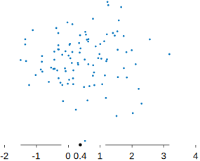
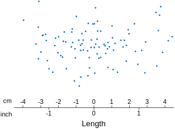
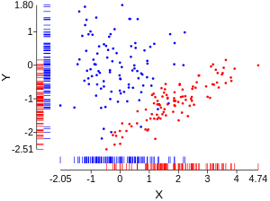
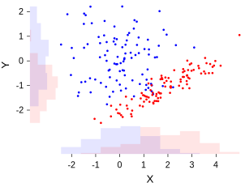
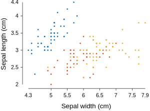
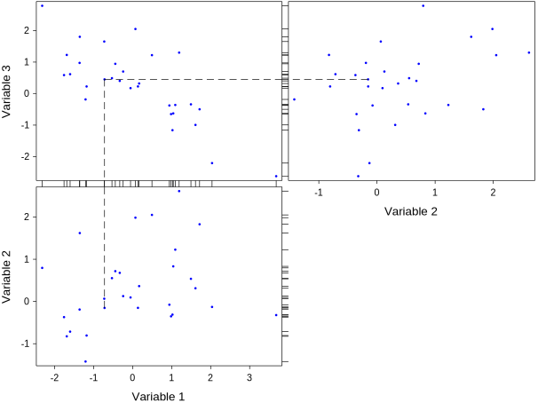

# sideaxes-m

A MATLAB function and accompanying toolbox for displaying rich information on the borders and margins of plots.

Table of Contents
=================

* [Overview](#overview)
* [Installation](#installation)
* [Usage](#usage)
* [Credits](#credits)
* [License](#license)

Overview
========

Are you trying to make publication quality plots in MATLAB? Are you struggling with getting the ticks or tick labels to display properly? Would you like to visualize marginal distributions of your scatter data? Have you just read Edward Tufte's *Visual Display of Quantitative Information* and would like to try some of the *small multiples*, *dot-dash plots*, *rug plots* or *range frames* in MATLAB? Sounds like you need `sideaxes.m`!

`sideaxes.m` is a low level function that creates a new axes object on the side of a main axes object. On this new axes object, all of the labels, ticks, marginal distributions and other data are plotted just as one would plot on a typical axes object e.g. using `line`, `text`, `plot` and other commands. In all of the examples provided, MATLAB's internal axes are disabled using `set(gca,'visible','off')`, with all the ticks, labels and framelines added manually. `sideaxes.m` is accompanied by functions for adding ticks and labels, to bring back some of the convenience lost for not using MATLAB's internal ticks and labels.

The key novelty of `sideaxes.m` is that in its default mode of operation, the new axes object has a convenient coordinate system (see the figure below). The x-axis is linked to the original x- or y-axis of the parent, and y-axis is pointing away from the main axes. Y-coordinate is in centimeters, so you are effectively plotting in "centimeters away from the main axes". This coordinate system is convenient for ticks (e.g. dot-dash plots or having multiple scales on one axis) or range frames.


`sideaxis.m` can also be used to make two axis side by side with their x-axis or y-axis just linked. This is really convenient for making small multiples or having several plots sharing one x-axis or y-axis.

Installation
============

After downloading, you should add `sideaxes.m` to your matlab path. For example:

```
addpath('/path/to/sideaxes-m/')
```
   
Note that `sideaxes.m` is a standalone function and does not rely on other functions to work. All of the other functions are just for convenience and you might consider replacing them with your own.

Usage
=====

Quick example
-------------

```
x = randn(100,1)+0.5;                % synthesize data
y = randn(100,1);
axes('Position',[0.05 0.1 0.9 0.9]); % create main axes
plot(x,y,'.'); 
set(gca,'visible','off')             % disable matlab's own tick marks
sideaxes('south');                   % add sideaxes to south for ticks
ticks(-5:5);                         % add custom tick marks
labels(-5:5);                        % add custom labels for the tick marks
rangeline(min(x),quantile(x,0.25));  % show minimum and first quantile
plot(median(x),0,'k.','MarkerSize',10); % show median as a dot
labels(median(x),[],@(x) sprintf('%.1f',x),'Clipping','off');
rangeline(quantile(x,0.75),max(x));  % third quantile  
```

produces:



Tips
----

- Remember to set(gca,'visible','off') for the main plot to disable Matlab's own ticks, grids etc.
- Study how `rangeline.m` and `ticks.m` take advantage of the convenient coordinate system so that their implementation is very simple. Try writing your own versions of these functions to internalize how the coordinate system works.
- The `location` parameter passed to `sideaxes.m` is stored in the UserData of the newly created axes. This is a bit of a hack, but `labels.m` uses this to know on which side to display the labels by default. You may need this information if you write generic functions to work along with `sideaxes.m`.
- All of the functions provided pass unrecognized name value parameter pairs to the functions used internally. Thus: `ticks(...,'Color','b')` and `labels(...,'FontName','Times New Roman')` both work.
- `ticks.m` can make the ticks go inside the plot area: just disable clipping by `ticks(...,'clipping','off')`. Ticks does not recognize this parameter - it is just passed forward to the internally used `line` command.
- use `sideaxes('east','orientation','north')` to keep the Y-axis pointing up when making two plots side by side.
- For publication quality plots, working in centimeters or inches is recommended, and then using the fantastic export_fig (https://se.mathworks.com/matlabcentral/fileexchange/23629-export-fig) toolbox for exporting.
- To make SVG plots for the web: use export_fig to create .pdf, then use inkscape to convert .pdf to .svg

More examples
-------------

Include outside and inside tick marks with different scales, for example inches and centimeters (source: [examples/example_multipleticks.m](examples/example_multipleticks.m))



Use dashes on the edge to visualize marginal distributions (Tufte calls this dot-dash plot) (source: [examples/example_dotdash.m](examples/example_dotdash.m))



The histograms show marginal distributions (source: [examples/example_histograms.m](examples/example_histograms.m))



The frame line extends to the minimum/maximum of data (source: [examples/example_rangeframe.m](examples/example_rangeframe.m))



Rug plots, which is a combination of several dot-dash plots. (source: [examples/example_rugplot.m](examples/example_rugplot.m))



Credits
=======

Veikko Sariola, Tampere University of Technology, 2017-2018

The inspiration for this toolbox came after reading Edward Tufte's *Visual Display of Quantitative Information*. Reading the book cannot be recommended enough.

License
=======

MIT, see [LICENSE](LICENSE)
